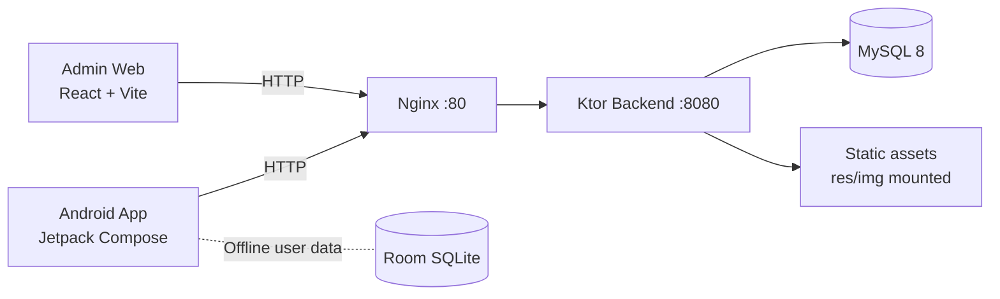

# Emotion Friend
<h2 align="left">
📱 <a href="https://drive.google.com/drive/folders/11IXtddY49nT91i_Chc1bE2_PgtKz4Qx-?usp=drive_link">
Download APK
</a>
</h2>

Nền tảng hỗ trợ trẻ em rối loạn phổ tự kỷ (ASD) rèn luyện kỹ năng cảm xúc qua học tương tác, kể chuyện, tình huống xã hội và bài tập điều tiết cảm xúc.

[](android-app/)
[](android-app/)
[](backend-api/)
[](infra/)
[](admin-web/)
[](LICENSE)

## 1. Giới Thiệu Hệ Thống


Emotion Friend là hệ thống gồm 3 lớp chính:

- Ứng dụng Android cho trẻ em: trải nghiệm học cảm xúc, luyện tập, ghi nhật ký, theo dõi tiến trình.
- Backend API: cung cấp dữ liệu nội dung, kịch bản học, truyện tranh, quản trị nội dung và endpoint tiến trình.
- Admin Web: giao diện quản trị nội dung (topic, scenario, story, music) phục vụ vận hành học liệu.

Định hướng thiết kế của hệ thống:

- Child-safe UI: màu sắc dịu, tương tác rõ, phản hồi tức thì.
- Offline-first ở mobile: dữ liệu người dùng lưu local để trải nghiệm ổn định.
- Triển khai đơn giản bằng Docker Compose cho backend stack.

## 2. Kiến Trúc Tổng Thể



## 3. Thành Phần Kỹ Thuật

### Android App

- Kotlin 2.0, Jetpack Compose Material 3
- Navigation Compose, ViewModel + StateFlow
- Hilt + KSP, Room, WorkManager, CameraX
- Ktor client, Coil image loading
- Min SDK 26, Target SDK 35

### Backend API

- Ktor 2.3.12 (Netty)
- Exposed ORM + HikariCP
- Flyway migration
- MySQL Connector/J 8.4

### Admin Web

- React 18 + TypeScript
- Vite 5

## 4. Tính Năng Hệ Thống

- Learn Emotion: flashcard và câu hỏi trắc nghiệm cảm xúc.
- Situation Learning: tình huống xã hội, chọn cảm xúc phù hợp theo ngữ cảnh.
- Story Mode: kể chuyện theo trang, kết hợp ảnh minh hoạ.
- Journal: ghi nhận cảm xúc hiện tại của trẻ.
- Progress: tổng hợp kết quả luyện tập và nhật ký.
- Relax: nội dung hỗ trợ thư giãn và tự điều tiết.
- Camera Practice: luyện biểu đạt khuôn mặt với CameraX (mức MVP).

## 5. Luồng Dữ Liệu Chính

1. Android gọi API qua Nginx để lấy nội dung học.
2. Backend truy xuất MySQL và trả JSON cho mobile/admin.
3. Android lưu dữ liệu người dùng local (Room) để bảo toàn trải nghiệm.
4. Backend phục vụ static images từ `res/img` thông qua mount volume Docker.

## 6. Cấu Trúc Repository

```text
emotion-friend/
├── android-app/      # Mobile app (Kotlin, Compose, Room, Hilt)
├── backend-api/      # Ktor API service
├── admin-web/        # React/Vite admin panel
├── res/img/          # Học liệu hình ảnh (stories, scenarios, miss-vy)
├── nginx/            # Reverse proxy config
├── docs/             # Tài liệu kỹ thuật, vận hành, build/deploy
├── docker-compose.yml
└── docker-compose.https.yml
```

## 7. Nhiều điều thú vị


## 8. Chạy Nhanh Hệ Thống

### 8.1 Backend + MySQL + Nginx (Docker)

```bash
docker compose --env-file .env up -d --build
```

Kiểm tra health:

```bash
curl http://localhost/health
```

### 8.2 Admin Web

```bash
cd admin-web
npm install
npm run dev
```

### 8.3 Android App

```bash
cd android-app
./gradlew.bat :app:installDebug
```

Lưu ý cấu hình mobile endpoint tại `android-app/.env`:

```env
BACKEND_URL=http://10.0.2.2:80
```

## 9. API Tiêu Biểu

- `GET /health`
- `GET /api/topics`
- `GET /api/scenarios`
- `GET /api/stories`
- `POST /api/journal-entries`
- `POST /api/practice-attempts`
- `GET /api/progress/{childId}`

## 10. Chất Lượng & Vận Hành

- Android: detekt, unit test, assemble debug qua CI.
- Backend: test + build trong GitHub Actions.
- Docker healthcheck cho MySQL và backend.
- Logs container giới hạn dung lượng để vận hành ổn định.

## 11. Giới Hạn Hiện Tại (MVP)

- Chưa có đa hồ sơ người dùng/đăng nhập phụ huynh hoàn chỉnh.
- Camera chưa triển khai nhận diện cảm xúc AI production.
- Đồng bộ đa thiết bị chưa phải phạm vi chính của bản P6.

## 12. Tài Liệu Liên Quan

- [docs/PROJECT_SCOPE.md](docs/PROJECT_SCOPE.md)
- [docs/LOCAL_ENVIRONMENT.md](docs/LOCAL_ENVIRONMENT.md)
- [docs/BACKEND_SETUP.md](docs/BACKEND_SETUP.md)
- [docs/BUILD_AND_RELEASE.md](docs/BUILD_AND_RELEASE.md)
- [docs/DEVELOPMENT_WORKFLOW.md](docs/DEVELOPMENT_WORKFLOW.md)

---

Nếu bạn cần, README có thể tách thêm bản tiếng Anh song song để phục vụ demo hội đồng hoặc đối tác kỹ thuật.