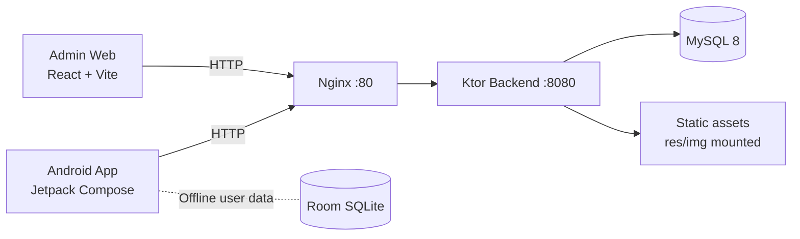

# Emotion Friend
<h2 align="left">
📱 <a href="https://drive.google.com/drive/folders/11IXtddY49nT91i_Chc1bE2_PgtKz4Qx-?usp=drive_link">
Download APK
</a>
</h2>

Nền tảng hỗ trợ trẻ em rối loạn phổ tự kỷ (ASD) trong độ tuổi 4–10 rèn luyện kỹ năng cảm xúc qua học tương tác, kể chuyện, tâm sự cùng AI và bài tập điều tiết cảm xúc.

[](android-app/)
[](android-app/)
[](backend-api/)
[](infra/)
[](admin-web/)
[](LICENSE)

## 1. Giới Thiệu Hệ Thống

Emotion Friend là hệ thống gồm 3 lớp chính:

- **Ứng dụng Android cho trẻ em:** trải nghiệm học cảm xúc qua quiz tình huống, kể chuyện, tâm sự cùng AI, ghi nhật ký cảm xúc, thư giãn và theo dõi tiến trình.
- **Backend API:** cung cấp dữ liệu nội dung (topic, scenario, story, music), xử lý nhật ký cảm xúc, lịch sử luyện tập, tiến trình học và xác thực người dùng.
- **Admin Web:** giao diện quản trị nội dung (topic, scenario, story, music) phục vụ vận hành học liệu, bảo vệ bằng Bearer token.

Định hướng thiết kế của hệ thống:

- **Autism-friendly UI:** bảng màu dịu nhẹ (Sky Blue, Mint Green, Warm Cream), icon lớn, tối giản text, phản hồi tức thì.
- **Nhân vật đồng hành Cô Vy:** giáo viên ảo với 6 biểu cảm, giọng nói TTS xuyên suốt toàn bộ app.
- **Offline-first ở mobile:** dữ liệu người dùng lưu local (Room + DataStore) để trải nghiệm ổn định.
- **Triển khai đơn giản:** Docker Compose cho toàn bộ backend stack.

## 2. Kiến Trúc Tổng Thể



## 3. Thành Phần Kỹ Thuật

### Android App

- Kotlin 2.0, Jetpack Compose Material 3 (BOM 2024.08)
- Navigation Compose 2.7.7, ViewModel + StateFlow
- Hilt 2.51.1 + KSP, Room 2.6.1, DataStore 1.1.1
- WorkManager 2.9.1, CameraX 1.3.4
- Ktor Client 2.3.12, Coil 2.7.0
- Android Speech-to-Text (STT) tích hợp sẵn
- Min SDK 26 (Android 8.0), Target SDK 35

### Backend API

- Kotlin 2.0, Ktor 2.3.12 (Netty)
- Exposed ORM 0.54.0 + HikariCP 5.1.0
- Flyway migration (11 phiên bản, `V1` → `V11`)
- MySQL Connector/J 8.4, JVM toolchain 21
- OpenAI API tích hợp (tính năng Tâm sự)

### Admin Web

- React 18 + TypeScript, Vite 5
- Phục vụ qua Nginx, bảo vệ bằng ADMIN_TOKEN

## 4. Tính Năng Ứng Dụng

### Màn hình chính

| Màn hình | Mô tả |
|---|---|
| **Daily Check-in** | Mở app hỏi cảm xúc hôm nay, hỗ trợ chọn icon + ghi chú + thu âm giọng nói |
| **Home (Dashboard)** | 7 card điều hướng với emoji minh hoạ; cô Vy chào hỏi bằng giọng nói |

### Các module học

| Module | Màn hình | Mô tả |
|---|---|---|
| 📚 **Học cảm xúc** | `LearnScreen` | Quiz theo bộ tình huống (LessonSet); ảnh minh hoạ + đọc tên cảm xúc; phản hồi đúng/sai bằng giọng cô Vy + hiệu ứng confetti; lưu tiến trình từng câu qua DataStore |
| 📖 **Kể chuyện** | `StoryScreen` | 5 câu chuyện gốc dạng truyện tranh; lật trang ngang (HorizontalPager); cô Vy kể chuyện bằng TTS; bày tỏ cảm xúc sau khi đọc xong |
| 💬 **Tâm sự** | `ConfideScreen` | Chat với AI (cô Vy) qua text hoặc mic (STT); OpenAI API + fallback rule-based khi hết quota; phản hồi bằng giọng TTS |
| 📓 **Cảm xúc của con** | `JournalScreen` | Xem lại nhật ký cảm xúc theo ngày; phát lại audio đã ghi âm; thêm entry mới bất cứ lúc nào |
| 🌈 **Thư giãn** | `RelaxScreen` | Thở cùng Bóng (hoạt hình nhịp thở 3 giây), Nghe nhạc nhẹ; Xếp hình (đang phát triển) |
| 🌟 **Tiến trình** | `ProgressScreen` | Thống kê số câu đúng/sai theo cảm xúc, biểu đồ tiến trình luyện tập |
| 🧒 **Hồ sơ** | `ProfileScreen` | Cập nhật tên, chọn avatar emoji; bật/tắt thông báo nhắc giờ học hằng ngày |

### Tính năng bổ trợ

- **Camera Practice** (`ExpressScreen` + `ExpressCameraScreen`): luyện biểu đạt khuôn mặt với CameraX — MVP preview.
- **Xác thực người dùng** (`LoginScreen`, `RegisterScreen`, `VerifyEmailScreen`, `ForgotPasswordScreen`): đăng ký, đăng nhập, xác thực email, quên mật khẩu.
- **Nhân vật Cô Vy:** 6 biểu cảm (Happy, Sad, Angry, Surprised, Calm, Tired) đồng hành theo ngữ cảnh từng màn hình.

## 5. Luồng Dữ Liệu Chính

1. Android gọi API qua Nginx để tải nội dung học (topics, scenarios, stories, music).
2. Backend truy xuất MySQL và trả JSON cho mobile/admin.
3. Android lưu tiến trình và dữ liệu người dùng local (Room + DataStore) — không mất khi offline.
4. Backend phục vụ static images (ảnh tình huống, ảnh truyện, ảnh cô Vy) từ `res/img` qua Docker volume mount.
5. Tâm sự: Android gửi message → Backend gọi OpenAI API → trả phản hồi về app.

## 6. Cấu Trúc Repository

```text
emotion-friend/
├── android-app/      # Mobile app (Kotlin, Compose, Room, Hilt)
├── backend-api/      # Ktor API service
├── admin-web/        # React/Vite admin panel
├── res/              # Học liệu: ảnh (img/) và nhạc thư giãn (aud/)
├── nginx/            # Reverse proxy config (HTTP + HTTPS)
├── docs/             # Tài liệu kỹ thuật, vận hành, build/deploy
├── deploy/           # Config triển khai Ubuntu HTTP
├── docker-compose.yml
└── docker-compose.https.yml
```

## 7. Hình Ảnh Minh Hoạ


## 8. Chạy Nhanh Hệ Thống

### 8.1 Backend + MySQL + Nginx (Docker)

```bash
cp .env.example .env   # Điền OPENAI_API_KEY, MYSQL_ROOT_PASSWORD, ADMIN_TOKEN
docker compose --env-file .env up -d --build
```

Kiểm tra health:

```bash
curl http://localhost/health
```

### 8.2 Admin Web

```bash
cd admin-web
npm install
npm run dev   # http://localhost:5173
```

### 8.3 Android App

```bash
cd android-app
# Cấu hình BACKEND_URL tại android-app/.env
./gradlew.bat :app:installDebug
```

```env
# android-app/.env
BACKEND_URL=http://10.0.2.2:80       # Emulator
# BACKEND_URL=http://192.168.x.x:80  # Thiết bị thật trên LAN
```

## 9. API Endpoints

| Method | Path | Mô tả |
|---|---|---|
| `GET` | `/health` | Kiểm tra trạng thái server |
| `GET` | `/api/topics` | Danh sách chủ đề học |
| `GET` | `/api/topics/{id}/scenarios` | Tình huống theo chủ đề |
| `GET` | `/api/scenarios` | Toàn bộ tình huống |
| `GET` | `/api/stories` | Danh sách câu chuyện |
| `GET` | `/api/emotions` | Danh sách loại cảm xúc |
| `POST` | `/api/auth/register` | Đăng ký tài khoản |
| `POST` | `/api/auth/login` | Đăng nhập |
| `POST` | `/api/auth/verify-email` | Xác thực email |
| `POST` | `/api/auth/forgot-password` | Quên mật khẩu |
| `POST` | `/api/journal-entries` | Tạo nhật ký cảm xúc |
| `GET` | `/api/journal-entries/{childId}` | Lấy nhật ký theo trẻ |
| `POST` | `/api/practice-attempts` | Ghi lại lần luyện tập |
| `GET` | `/api/practice-attempts/{childId}` | Lịch sử luyện tập |
| `GET` | `/api/progress/{childId}` | Tiến trình tổng hợp |
| `GET` | `/api/progress/{childId}/history` | Lịch sử tiến trình |
| `POST` | `/api/expression-practice/result` | Kết quả luyện biểu đạt camera |
| `*` | `/admin/*` | Quản trị nội dung (Bearer token) |

## 10. Chất Lượng & Vận Hành

- Android: detekt static analysis, unit test, assemble debug qua GitHub Actions CI.
- Backend: test + build + shadow JAR trong GitHub Actions CI.
- Docker healthcheck cho MySQL (`mysqladmin ping`) và backend (`wget /health`).
- Logs container giới hạn `10m / 3 file` để vận hành ổn định trên VPS.
- Hỗ trợ HTTPS qua Let's Encrypt + Certbot tự động gia hạn (`docker-compose.https.yml`).

## 11. Giới Hạn Hiện Tại (P6 MVP)

- Camera Practice chưa tích hợp nhận diện cảm xúc AI production (đang ở mức CameraX preview).
- Xếp hình trong module Thư giãn đang trong quá trình phát triển.
- Đồng bộ dữ liệu đa thiết bị chưa nằm trong phạm vi bản P6.
- OpenAI quota giới hạn — đã có fallback rule-based dự phòng.

## 12. Tài Liệu Liên Quan

- [docs/PROJECT_SCOPE.md](docs/PROJECT_SCOPE.md)
- [docs/BACKEND_SETUP.md](docs/BACKEND_SETUP.md)
- [docs/BUILD_AND_RELEASE.md](docs/BUILD_AND_RELEASE.md)
